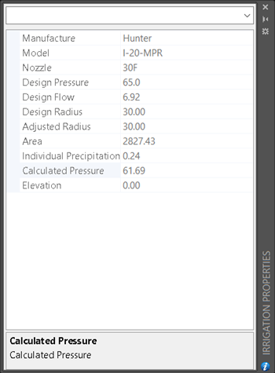
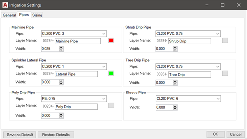

# Welcome to the Raindrop Documentation

## Additional Resources

Need help or have an idea for improving Raindrop? [Ask for help or 🚨report a bug🐛🚨 in our forum. ](https://forum.raindropirrigationsoftware.com/)

Join our public discord office, interact  with staff during office hours with chat📝, voice🗣️, and screen sharing🖥️.  [Join Raindrop Discord](https://discord.gg/W3Avvakxcc)

Didn’t find what you’re looking for in all of our documentation or forums articles? 📨 [Contact our support team 📨](https://www.raindropirrigationsoftware.com/contact-support/).

---
## Getting Started
Raindrop is not a standalone program, it is a plugin requiring AutoCAD.

Download and run the installer. The installer will copy the program to your folder, and set your CAD program to load Raindrop at startup.
<iframe width="560" height="315" src="https://www.youtube.com/embed/vyAWG1Iv2pA?rel=0" frameborder="0" allow="autoplay; encrypted-media" allowfullscreen></iframe>

---

<h2>Irrigation Properties Palette</h2>

The *Irrigation Properties* window shows additional irrigation related properties of objects in the drawing. To show the irrigation properties window, click the information button on the irrigation tool.

****

<h2> Project Settings</h2>

Use the *Project Settings* dialog to change project settings such as drawing scale, pipe types, and layers. To access the settings dialog, click the gear button on the tools palette.

